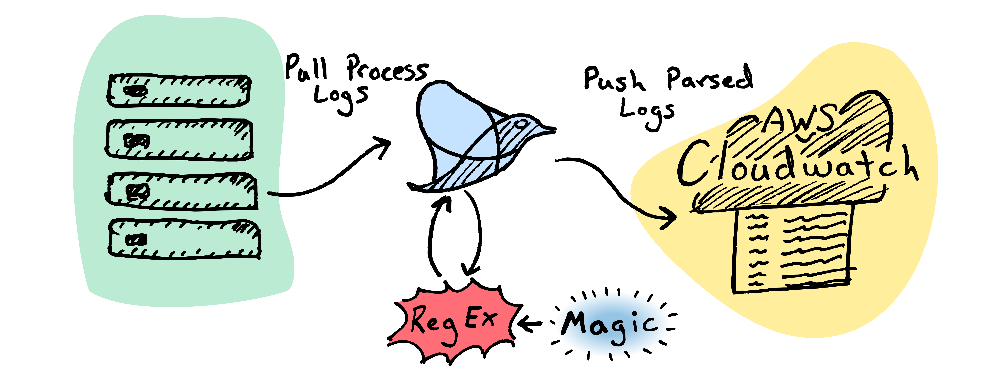
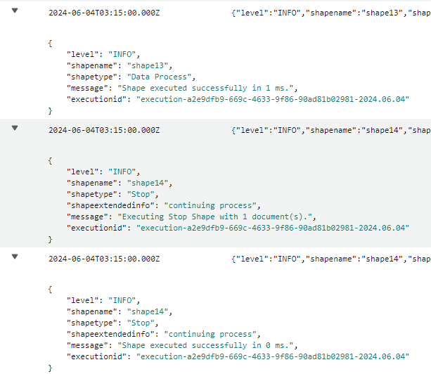

Process logs within Boomi are the basic logs used to review processes and what occurred during the process execution. They can easily be view and consumed within [Process Reporting](https://help.boomi.com/docs/atomsphere/integration/integration%20management/c-atm-process_reporting_c49a74c4-026d-4c0d-a69e-4fca30ed34a3/). Although, there are various reasons why a company would choose to consume these logs within a central log repository. Within Process Reporting the metadata for these logs are only retained within Process Reporting for 30 days. After 30 days these logs become almost impossible to consume. There could be regulatory reasons why a company would want to retain these logs for longer periods of time, or a company could use a central log repository that alerts are configured. 

The rest of the article is going to walk through how to set up Fluentd to consume process logs within their original XML format and forward them to AWS Cloudwatch. 


## Process Logs

When Boomi writes process logs to disk, they are in an XML format. Below is a truncated example of an XML process log. 

```xml
<?xml version="1.0" encoding="UTF-8" ?>
<ExecutionLogModel>
<LogEvent level="INFO" time="2024-06-04T02:57:00Z" shapename="initializing..." shapetype="initializing..." shapelabel="" shapeextendedinfo="">
<Message>Executing Process 5 min process</Message>
</LogEvent>
<LogEvent level="INFO" time="2024-06-04T02:57:00Z" shapename="shape1" shapetype="Start" shapelabel="" shapeextendedinfo="NoData">
<Message>Executing Start Shape</Message>
</LogEvent>
<LogEvent level="INFO" time="2024-06-04T02:57:00Z" shapename="shape1" shapetype="Start" shapelabel="" shapeextendedinfo="NoData">
<Message>1 document(s) found for processing.</Message>
</LogEvent>
<LogEvent level="INFO" time="2024-06-04T02:57:00Z" shapename="shape1" shapetype="Start" shapelabel="" shapeextendedinfo="NoData">
<Message>Shape executed successfully in 4 ms.</Message>
</LogEvent>
</ExecutionLogModel>
```

The same data can be downloaded from process reporting and the process log would look like this. 

```
2024-06-04T02:57:00Z	INFO	initializing...		Executing Process 5 min process
2024-06-04T02:57:00Z	INFO	Start	NoData	Executing Start Shape
2024-06-04T02:57:00Z	INFO	Start	NoData	1 document(s) found for processing.
2024-06-04T02:57:00Z	INFO	Start	NoData	Shape executed successfully in 4 ms.
```

While the process is execution, the process_log.xml files are written to `<install-dir>/execution/current`. Once complete, Atoms and Molecules write them to `<install-dir>/execution/history`. Atom Clouds write them to `<install-dir>/accounts/<instance-id>/execution/history` once the execution is complete. The process logs within an Atom Cloud can only be pulled if it is a self-hosted Private Atom Cloud. Within the `history` directory there is usually some nesting and then a directory with the execution id and then the process_log.xml within it. Below is the full path of a directory where a process_log.xml is located. Notice the additional directories between `history` and the `process_log.xml`. The configuration will only pull logs once they are moved to the `history` directory.

```bash
/boomi/share/molecule/aws_ubuntu_molecule/execution/history/2024.06.04/68/52/execution-68523591-b704-4e4c-abf3-ad659798a7b6-2024.06.04/process_log.xml
```

## Installing Fluentd

Fluentd is an open-source data collection tool that can be used for collecting and parse logs, and forwarding them to a repository. Since it is cross-platform, there are a few ways to install Fluentd. Additionally, there are two distributions of Fluentd: `fluent-package` and `calyptia-fluentd`. `fluent-package` is distributed by the [Fluentd Project](https://www.fluentd.org/) and `calyptia-fluentd` is distributed by [Calyptia, Inc](https://www.calyptia.com/). The article is going to cover how to install `fluent-package` on Ubuntu 22.04 Jammy. Visit [Fluentd's Installation Doc](https://docs.fluentd.org/installation) for how to install Fluentd on other Operating Systems. 

First download and install fluentd.
```bash
curl -fsSL https://toolbelt.treasuredata.com/sh/install-ubuntu-jammy-fluent-package5-lts.sh | sh
```

Start the fluentd service
```bash
sudo systemctl start fluentd.service
```

Check the status of the service.
```bash
sudo systemctl status fluentd.service
```

## Configuring Fluentd

Once, fluentd is installed, it needs to be configured to pull data. This example consumes process logs and write it to AWS Cloudwatch. 

Back up the original `fluentd.conf` config file.

```bash
sudo mv /etc/fluent/fluent.conf /etc/fluent/fluent.conf.bak
```

Create a new `fluentd.conf` file.

```bash
sudo vim /etc/fluent/fluent.conf
```

Paste the following config file into the editor. Often you can right click within the editor or `shift+ctrl+P`. The parts that need to be updated to your set are the path under source. This should be the installation directory if your runtime. Next the entire match cloudwatch.logs section should be updated to reflect your configuration. 

```xml
<system>
  plugin_dir /etc/fluent/plugin
</system>

<source>
  @type tail
  path /boomi/share/molecule/aws_ubuntu_molecule/execution/history/**/process_log.xml
  path_key directory
  pos_file /var/log/fluent/process_log.pos
  tag cloudwatch.logs
  read_from_head true
  <parse>
    @type multiline
    format_firstline /^<LogEvent/
    format1 /<LogEvent level="(?<level>[^"]*)" /
    format2 /time="(?<time>[^"]*)" /
    format3 /shapename="(?<shapename>[^"]*)" /
    format4 /shapetype="(?<shapetype>[^"]*)" /
    format5 /shapelabel="(?<shapelabel>[^"]*)" /
    format6 /shapeextendedinfo="(?<shapeextendedinfo>[^"]*)">\n/
    format7 /<Message>(?<message>[^<]*)<\/Message>.*\n/
    format8 /<\/LogEvent>/
    time_format %Y-%m-%dT%H:%M:%SZ
  </parse>
</source>

<filter cloudwatch.logs>
  @type record_transformer
  enable_ruby true
  <record>
    executionid ${record["directory"].split('/')[-2]}
  </record>
  remove_keys directory
</filter>

<match cloudwatch.logs>
  @type cloudwatch_logs
  log_group_name ab_boomi_molecule
  log_stream_name ab_boomi_molecule_01
  auto_create_stream true
  region us-east-1
</match>
```

Next press the following keys to write and save the file. 
```
esc 
:wq
enter
```

Restart fluentd.

```bash
sudo systemctl restart fluentd.conf
```

If everything worked successfully, then within ~5 minutes the logs will start to populate AWS Cloudwatch. If there are issues, the review the troubleshooting section below. 



*Figure 1. AWS Cloudwatch Logs from Fluentd.*


## Troubleshooting

One of the main ways to troubleshot is to write addition information to the logs. To update the [logging](https://docs.fluentd.org/deployment/system-config#log_level) to trace level, add the `log_level trace` to the fluent.conf config file and restart the fluentd service. 

```xml
<system>
  log_level trace
  plugin_dir /etc/fluent/plugin
</system>
```

The fluentd log files can be found within `/var/log/fluent/fluent.log`.


# References

- [Fluentd Docs](https://docs.fluentd.org/)
- [GitHub adambedenbaugh/boomi-fluentd-process-logger]()


The article was originally posted at [Boomi Community](https://community.boomi.com/s/article/Consume-Process-Logs-with-Fluentd).


